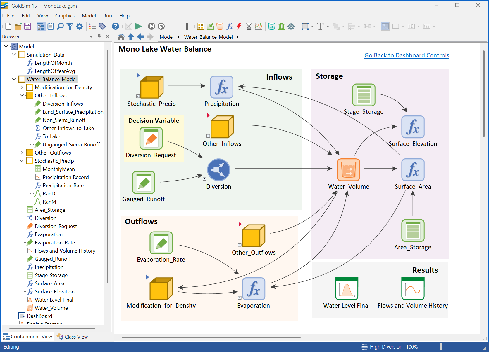

# Lesson 1: Welcome to the Course

## Welcome to the Self-Paced Water Management Modeling Course using GoldSim!

As water management is becoming increasingly complex, this course will equip you with the GoldSim tools and techniques needed to model and analyze even the most challenging water systems.

It's designed to enhance your understanding of GoldSim's capabilities and introduce you to a comprehensive library of functions, components, and methodologies tailored to meet your water management modeling needs.

## Who Should Attend?

This course is perfect for individuals who have a foundational understanding of GoldSim and want to use a dynamic simulation tool to model complex water systems, often integrating multiple disciplines.

If you're working with uncertain inputs, intricate flow controls, multiple storage components, and time-varying demands, this course is designed for you.

**Typical attendees include:**
- Environmental engineers
- Water resource planners  
- Consultants working on water-related projects
- Academics and researchers

While tailored for water resources, please note that GoldSim itself is a versatile dynamic simulation tool applicable across many industries for systems modeling, risk analysis, and decision support.

## Prerequisites

To ensure you're fully prepared for the advanced topics covered, we highly recommend that you either:

- **Complete the free, online Basic GoldSim Course**, or
- **Have a minimum of 40 hours of GoldSim modeling experience**

Meeting these prerequisites will help you gain the most from this challenging yet rewarding learning experience.

## What Will You Gain?

Upon completion of this course, you'll be able to:

- **Build dynamic system models** for water management
- **Analyze uncertainty, storage, and flow systems**
- **Support decision-making** in real-world water projects

**Example applications include:**
- Mine Water Balance Studies
- Water Resources Planning  
- Water Supply Facility Planning
- Environmental Compliance
- Mine Closure Logistics
- Integrated Water Resource Management

You'll also see how GoldSim integrates with tools like MS Excel and databases.

## Why Use GoldSim?

GoldSim excels where complex, dynamic systems are involved:

**Intuitive Interface:** Build custom, flexible models visually without needing to write code.

**Data Integration:** Easily integrate data from multiple sources (Excel, databases).

**Uncertainty Analysis:** Simulate complex systems under uncertainty using built-in probabilistic tools.

**Dynamic Simulation:** Unlike static tools, GoldSim's dynamic approach is ideal for visualizing how water systems behave and evolve over time, helping you optimize decisions.

## Course Structure

This course is organized into twelve comprehensive units, starting with this introduction. Each unit builds upon the previous one, gradually increasing in complexity.

The course utilizes standard GoldSim features alongside pre-built, specialized components designed to model complex water resource processes effectively.

### Part 1: The Building Blocks
- **Unit 1: Foundations and Data Preparation** - Introduction to the course, objectives, and basic concepts
- **Unit 2: Climate and Weather** - Working with precipitation and temperature data
- **Unit 3: Surface Water Hydrology** - Techniques for modeling surface water flow
- **Unit 4: Water Demand and Use** - Understanding water demand and usage

### Part 2: Building the Managed System  
- **Unit 5: Hydraulic Flow Controls** - Principles of hydraulic modeling
- **Unit 6: Reservoir Operations** - Modeling reservoirs and their management
- **Unit 7: Groundwater** - Modeling groundwater flow and interactions
- **Unit 8: Building Flow Networks** - Creating and managing flow networks

### Part 3: Advanced Topics & Applications
- **Unit 9: Water Quality and Ecology** - Addressing water quality and ecological impacts
- **Unit 10: Model Verification** - Techniques for model verification, calibration, and optimization
- **Unit 11: Specialized Applications** - Specific topics including mining operations
- **Unit 12: Risk and Reliability in Water Management** - Managing uncertainty and risk

## Time Commitment

- A typical unit may take **1 to 5 hours**, depending on your experience and the complexity of the material
- Work at your own pace; the platform will save your progress
- The course is self-paced, allowing you to learn at your own speed
- A certificate of completion is available

## Conclusion

GoldSim is a powerful decision-support system for water management challenges. While you won't become an expert overnight, you'll gain the comfort and understanding needed to effectively design, build, and interpret these types of models.

If you're ready to enhance your skills, let's move on to the next lesson to get you set up with the course resources!

---

## Exercise

This Water Management Modeling Course using GoldSim is primarily designed for individuals who are interested in which of the following applications or capabilities?

**A)** Learning GoldSim from scratch with no prior experience.

**B)** Performing only static, single-point-in-time calculations for simple water balances.

**C)** Building dynamic system models for complex water management, analyzing uncertainty, and supporting decision-making in real-world projects.

**D)** Troubleshooting software errors in GoldSim or developing custom GoldSim extensions.

---

**Correct Answer:** C) Building dynamic system models for complex water management, analyzing uncertainty, and supporting decision-making in real-world projects.

---

## Who Should Attend?

This course is designed for individuals who have a foundational understanding of GoldSim and want to model complex, integrated water systems. Typical attendees include:

* Environmental engineers
* Water resource planners  
* Consultants working on water-related projects
* Mining engineers dealing with water management
* Academic researchers in hydrology and water resources
* Regulatory professionals evaluating water system models

---

## Prerequisites

To get the most out of this course, you should have:

* **Basic GoldSim Experience**: Familiarity with creating simple models, understanding elements, and running simulations
* **Water Systems Knowledge**: Understanding of basic hydrological concepts such as precipitation, evaporation, runoff, and water balance
* **Engineering Background**: Comfort with mathematical concepts and engineering problem-solving approaches
* **Software Setup**: Access to GoldSim Pro or higher license (some modules require advanced features)

---

## What Will You Gain?

By the end of this course, you will be able to:

* **Model Integrated Water Systems**: Create comprehensive models that represent the full water cycle from precipitation to end use
* **Handle Complex Flow Networks**: Design and implement sophisticated hydraulic networks with multiple sources, storage, and demand points
* **Incorporate Uncertainty**: Use probabilistic approaches to account for variability in climate, demand, and system parameters
* **Perform Risk Analysis**: Evaluate system reliability, failure probabilities, and optimization scenarios
* **Apply Real-World Solutions**: Tackle actual water management challenges using industry-standard approaches and best practices

---

## Course Structure

This course is organized into 12 comprehensive units, each building on the previous material:

1. **Getting Started** - Foundation and setup
2. **Climate Drivers** - Modeling precipitation, temperature, and weather patterns
3. **Surface Flow Modeling** - Rivers, streams, and runoff processes
4. **Water Use** - Demand modeling and consumption patterns
5. **Reservoirs** - Storage systems and operational rules
6. **Tailings Storage Facilities** - Specialized mining applications
7. **Hydraulics** - Flow dynamics and pressure systems
8. **Groundwater** - Subsurface hydrology and aquifer modeling
9. **Representing a Flow Network** - Complex system integration
10. **Water Quality and Ecology** - Environmental considerations
11. **Analyses** - Optimization and scenario evaluation
12. **Risk and Reliability** - Uncertainty quantification and risk assessment

Each unit contains multiple hands-on lessons with practical exercises, real-world examples, and progressive model-building activities.

---

## Learning Approach

This course emphasizes:

* **Hands-On Learning**: Every concept is reinforced with practical GoldSim exercises
* **Progressive Complexity**: Models start simple and add layers of sophistication
* **Real-World Applications**: Examples drawn from actual water management projects
* **Best Practices**: Industry-standard approaches and modeling conventions
* **Problem-Solving**: Emphasis on engineering judgment and critical thinking

---

## Getting Started

Before proceeding to the next lesson, ensure you have:

1. **GoldSim Software**: Pro or higher license installed and activated
2. **Course Materials**: Access to all provided example files and datasets
3. **System Requirements**: Adequate computing power for complex simulations
4. **Time Commitment**: Plan for approximately 40-60 hours of total course work

Ready to begin? Let's move on to setting up your learning environment and accessing the course resources.
