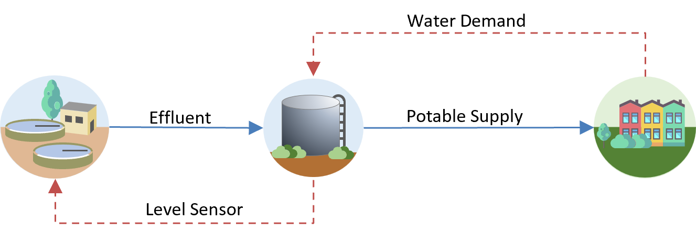
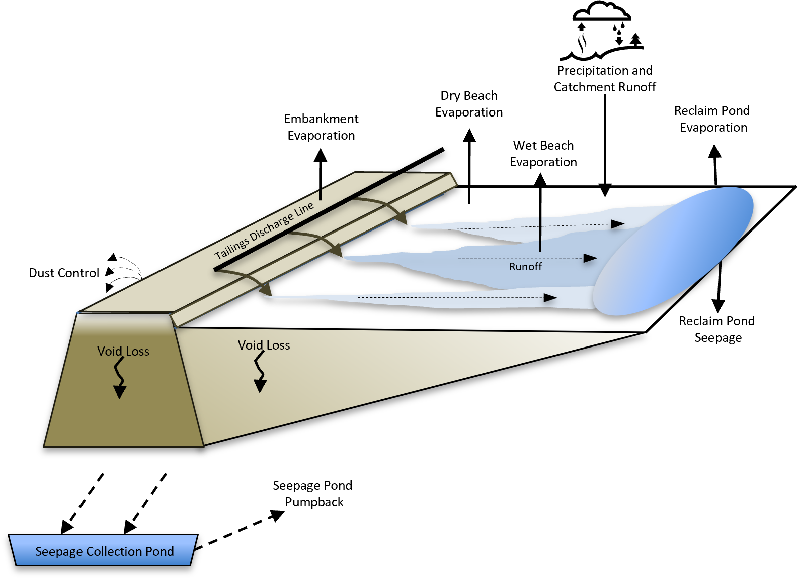

# Lesson 4: Overview of a Water Management System Model

## Learning Objectives

By the end of this lesson, students will be able to:
- **Identify** the six major components that constitute a typical water management system model
- **Analyze** the relationships between model drivers and managed water system components
- **Evaluate** the role of different analytical capabilities in GoldSim water management models
- **Apply** the conceptual framework to design the structure of a water management model

## Context / Overview

While every water management challenge is unique, most dynamic water management models share a common set of conceptual components and interconnected functions. Understanding these building blocks is essential for using GoldSim to solve complex water management problems. This lesson provides a comprehensive framework for the typical architecture of water management system models, establishing the foundation for all subsequent technical lessons in this course.

## Technical Content

### Understanding the System Model Diagram

To effectively model complex water management scenarios, it's helpful to understand the typical structure of these systems and how they are represented in GoldSim.

The diagram below illustrates the common components that make up most real-world water management models. Let's break down each section of this comprehensive system model.

```
[ WATER MANAGEMENT SYSTEM MODEL ]
     |
     +--- [ 1. Model Drivers ]
     |      |
     |      +--- Climate & Weather
     |      +--- Hydrological Processes
     |      +--- Water Demands
     |      +--- Policies
     |
     +--- [ 2. Managed Water System ]
     |      |
     |      +--- Flow Controls
     |      |      |
     |      |      +--- Hydraulic
     |      |      +--- Rule-based
     |      |      +--- Feedback
     |      |
     |      +--- Storage Components
     |      |      |
     |      |      +--- Surface Water
     |      |      +--- Tailings
     |      |      +--- Groundwater
     |      |
     |      +--- Contaminant Transport
     |      +--- Economics
     |
     +--- [ 3. Analysis ]
     |      |
     |      +--- Monte Carlo Simulation
     |      +--- Scenarios
     |      +--- Optimization
     |      +--- Sensitivity Analysis
     |
     +--- [ 4. Model Presentation ]
     |      |
     |      +--- Dashboards
     |      +--- Documentation
     |      +--- Charts & Tables
     |      +--- Diagrams
     |
     +--- [ 5. Model Validation ]
     |      |
     |      +--- Diagnostic Testing
     |      +--- Mass Balance
     |      +--- Model Calibration
     |
     +--- [ 6. External Functions ]
            |
            +--- `DLLs` (Dynamic Link Libraries)
            +--- Excel with Macros
```


## Model Drivers

At the foundation of any water management model are the external factors that drive the system. These are the "knowns" or "uncertainties" that the model responds to.

### Climate and Weather
These are typically significant drivers for a water system. This includes precipitation, temperature, solar radiation, wind speed, and other meteorological data that influence water availability and demand.

### Hydrological Processes
Represent the transformation of climate into water availability and demand. This could include evaporation, snowmelt, watershed runoff, and crop irrigation demand, which are critical for understanding how water is used in the system.

### Water Demands
Water systems are managed to meet various demands. These inputs define the water requirements for different users, such as municipal water supply, agricultural irrigation, industrial use, or environmental flow requirements.

### Policies
Regulatory policies, operational rules, water rights, and management strategies dictate how water is allocated, stored, and released within the system. These rules are crucial for simulating realistic system behavior and decision-making.


## System Model: Managed Water System

The system we are modeling represents the operational components that operate to attempt to produce the desired outcome.

### Flow Controls
These components govern the movement of water within the system.



**Hydraulic:** Represents physical structures and their associated hydraulic equations (e.g., weir flow, orifice discharge, pump curves, pipe flows).

**Rule-based:** Captures predefined operational policies and triggers (e.g., release X amount when reservoir level is above Y, divert water if demand is Z).

**Feedback:** Represents how the system's state influences its own operation (e.g., a low reservoir level triggers a reduction in outflow, or high demand activates a different water source).

### Storage Components
These are the elements that hold water within the system.

**Surface Water:** Lakes, reservoirs, ponds, and open channels where water is stored and managed.

**Tailings:** Specific to mining operations, representing the storage of process water and tailings solids in impoundments.

**Groundwater:** Aquifers and groundwater systems that store and transmit water below the surface.



### Contaminant Transport
While not always present, many water management models integrate the movement and fate of contaminants within the system (e.g., dissolved solids, pollutants in a reservoir or aquifer).

### Economics
This layer represents the economic drivers and financial aspects linked to water management, such as population changes, costs of supply or infrastructure, and economic benefits or losses associated with different management strategies.


## Analysis

GoldSim's analytical capabilities allow you to run the model in different ways to extract meaningful insights and answer specific questions. These represent the various types of analyses you can perform:

### Monte Carlo Simulation
A core strength of GoldSim, allowing you to run thousands of simulations with uncertain inputs to understand the range of possible outcomes and associated probabilities.

### Scenarios
Evaluating specific "what-if" situations (e.g., a severe drought scenario, a new demand profile) to assess system performance under different future conditions.

### Optimization
Finding the best set of operational rules or design parameters to achieve specific objectives (e.g., maximize water supply reliability while minimizing environmental impact).

### Sensitivity Analysis
Identifying which input parameters have the most significant influence on the model's outputs, helping to focus data collection efforts and understand key drivers of uncertainty.

It's also worth noting that you can build custom analytical functions within GoldSim. You can **import other models** (e.g., as `SubModels`) into your GoldSim model to act as an independent analytical component, such as pre-processing time series data.

While GoldSim allows you to build sophisticated data analysis functions directly, sometimes it is faster or more efficient to write specialized analysis in code and compile that to a Dynamic Link Library (`DLL`) which can then interact seamlessly with your GoldSim model.


## Model Presentation

Effectively communicating model results is as important as building the model itself. GoldSim provides several features to help you present your model and its outputs clearly:

### Dashboards
Custom interactive interfaces within GoldSim that allow users to visualize results and control model inputs without needing to navigate the underlying model structure. These can be designed to highlight key findings and build intuitive understanding.

### Documentation
Internal model documentation, external reports, and supporting materials that explain the model's assumptions, logic, data, and results. It is possible to build all the documentation within the GoldSim model using various text and graphical features.

### Charts and Tables
Standard graphical and tabular outputs generated by GoldSim to visualize time-series data, distributions, and summary statistics. This includes **big-picture visualizations** designed to help end-users (who may not be modelers) quickly grasp the model's overall behavior and visually confirm its reasonableness, fostering confidence that "yep, that makes sense."

### Diagrams
The visual nature of GoldSim's interface itself serves as a powerful diagram for understanding system components and their interconnections. It can be further clarified using background diagrams imported as an image or drawn right in the model itself.


## Model Validation

Ensuring the model is accurate and fit for its purpose is a critical step.

### Diagnostic Testing
Performing iterative checks during model construction by building parts and running them, often using temporary charts and tables to view specific outputs that explain local behavior within the model.

### Mass Balance
Verifying that water inputs and outputs are correctly accounted for within the model, ensuring conservation of mass.

### Model Calibration
Adjusting model parameters to improve the agreement between model predictions and observed historical data.


## External Functions

GoldSim is designed to be highly interoperable, allowing it to connect with other tools and programming languages.

### `DLLs` (Dynamic Link Libraries)
GoldSim can call external routines written in programming languages (e.g., C++, Fortran) encapsulated in `DLLs`, allowing for highly customized or computationally intensive calculations.

### Excel with Macros
GoldSim can seamlessly read from and write to Excel spreadsheets, leveraging Excel's capabilities for data processing, reporting, or even running specialized macros.


## Key Takeaways / Summary

- Water management models share common conceptual components despite being site-specific, providing a foundation for systematic model development
- Model drivers (climate, hydrology, demands, and policies) represent the external forces that influence system behavior
- Managed water systems contain flow controls, storage components, contaminant transport, and economic elements that respond to model drivers
- GoldSim's analytical capabilities include Monte Carlo simulation, scenario analysis, optimization, and sensitivity analysis for comprehensive system evaluation
- Model presentation and validation are essential components that ensure model results are communicated effectively and technically sound
- External functions enable GoldSim to integrate with specialized tools and programming languages for enhanced computational capabilities


## Assets Needed

### Reference Images
- `images/01_03_FlowControl.png` - Flow control components diagram
- `images/01_03_TailingsConcept.png` - Conceptual diagram of tailings storage facility


## Exercise / Activities

**Analysis Question:**
Why is it important to include both model drivers and managed water system components in a water management model? Give one example of each from the lesson.

## Quiz

**1.** In a typical GoldSim water management model, which of the following is considered a primary input or model driver that influences the system's behavior?

A) Model Validation results  
B) Climate and Weather data  
C) GoldSim Dashboards  
D) Unaccounted for losses

**Answer:** B) Climate and Weather data

**2.** The "Managed Water System" section of a GoldSim model diagram represents the core physical and operational components. Which of these categories would Flow Controls typically include?

A) Monte Carlo Simulation and Sensitivity Analysis  
B) Surface Water, Tailings, and Groundwater storage  
C) Hydraulic structures, Rule-based operations, and Feedback mechanisms  
D) External `DLLs` and Excel macros

**Answer:** C) Hydraulic structures, Rule-based operations, and Feedback mechanisms

**3.** When using GoldSim for Analysis, which of these capabilities allows you to understand the range of possible outcomes and associated probabilities by running numerous simulations with uncertain inputs?

A) Optimization  
B) Model Calibration  
C) Monte Carlo Simulation  
D) Diagnostic Testing

**Answer:** C) Monte Carlo Simulation

**4.** Which section of the model framework focuses on ensuring the model is accurate and fit for its purpose, often involving checking water inputs and outputs?

A) Model Presentation  
B) Inputs and Model Drivers  
C) Model Validation  
D) External Functions

**Answer:** C) Model Validation
