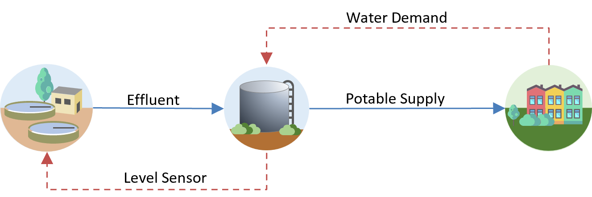
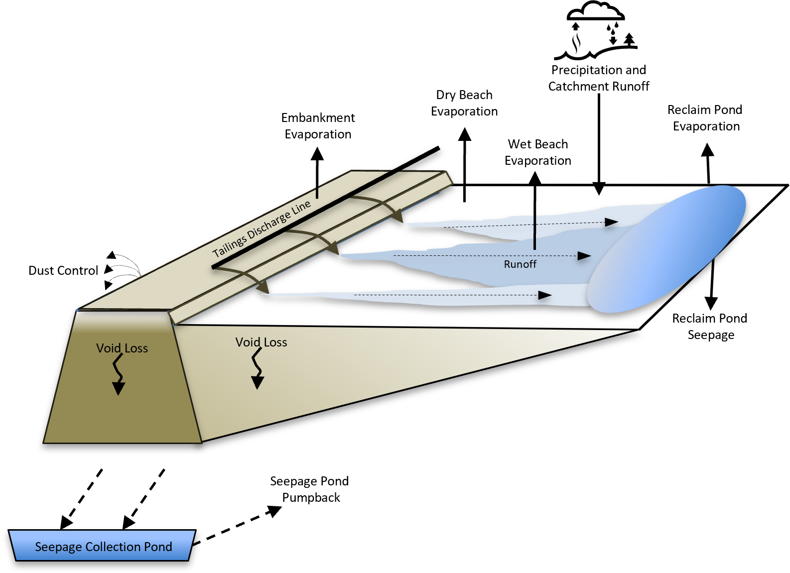

# Lesson 3: Overview of a Water Management System Model

**Objective:** By the end of this lesson, learners will be able to identify the key components and functions that typically constitute a dynamic water management model.

Every water management challenge is unique, and consequently, so is every water management model. However, despite their site-specific nature, most dynamic water management models share a common set of conceptual components and interconnected functions.

Understanding these fundamental building blocks helps you begin constructing models in GoldSim. In this lesson, we will explore the typical structure and components of a water management system model.

## Understanding the System Model Diagram

To effectively model complex water management scenarios, it's helpful to understand the typical structure of these systems and how they are represented in GoldSim.

The diagram below illustrates the common components that make up most real-world water management models. Let's break down each section of this comprehensive system model.

```
[ WATER MANAGEMENT SYSTEM MODEL ]
     |
     +--- [ 1. Model Drivers ]
     |      |
     |      +--- Climate & Weather
     |      +--- Hydrological Processes
     |      +--- Water Demands
     |      +--- Policies
     |
     +--- [ 2. Managed Water System ]
     |      |
     |      +--- Flow Controls
     |      |      |
     |      |      +--- Hydraulic
     |      |      +--- Rule-based
     |      |      +--- Feedback
     |      |
     |      +--- Storage Components
     |      |      |
     |      |      +--- Surface Water
     |      |      +--- Tailings
     |      |      +--- Groundwater
     |      |
     |      +--- Contaminant Transport
     |      +--- Economics
     |
     +--- [ 3. Analysis ]
     |      |
     |      +--- Monte Carlo Simulation
     |      +--- Scenarios
     |      +--- Optimization
     |      +--- Sensitivity Analysis
     |
     +--- [ 4. Model Presentation ]
     |      |
     |      +--- Dashboards
     |      +--- Documentation
     |      +--- Charts & Tables
     |      +--- Diagrams
     |
     +--- [ 5. Model Validation ]
     |      |
     |      +--- Diagnostic Testing
     |      +--- Mass Balance
     |      +--- Model Calibration
     |
     +--- [ 6. External Functions ]
            |
            +--- DLLs (Dynamic Link Libraries)
            +--- Excel with Macros
```

## Model Drivers

At the foundation of any water management model are the external factors that drive the system. These are the "knowns" or "uncertainties" that the model responds to.

### Climate and Weather
These are typically significant drivers for a water system. This includes precipitation, temperature, solar radiation, wind speed, and other meteorological data that influence water availability and demand.

### Hydrological Processes
Represent the transformation of climate into water availability and demand. This could include evaporation, snowmelt, watershed runoff, and crop irrigation demand, which are critical for understanding how water is used in the system.

### Water Demands
Water systems are managed to meet various demands. These inputs define the water requirements for different users, such as municipal water supply, agricultural irrigation, industrial use, or environmental flow requirements.

### Policies
Regulatory policies, operational rules, water rights, and management strategies dictate how water is allocated, stored, and released within the system. These rules are crucial for simulating realistic system behavior and decision-making.

## System Model: Managed Water System

The system we are modeling represents the operational components that operate to attempt to produce the desired outcome.

### Flow Controls
These components govern the movement of water within the system.



**Hydraulic:** Represents physical structures and their associated hydraulic equations (e.g., weir flow, orifice discharge, pump curves, pipe flows).

**Rule-based:** Captures predefined operational policies and triggers (e.g., release X amount when reservoir level is above Y, divert water if demand is Z).

**Feedback:** Represents how the system's state influences its own operation (e.g., a low reservoir level triggers a reduction in outflow, or high demand activates a different water source).

### Storage Components
These are the elements that hold water within the system.

**Surface Water:** Lakes, reservoirs, ponds, and open channels where water is stored and managed.

**Tailings:** Specific to mining operations, representing the storage of process water and tailings solids in impoundments.

**Groundwater:** Aquifers and groundwater systems that store and transmit water below the surface.



### Contaminant Transport
While not always present, many water management models integrate the movement and fate of contaminants within the system (e.g., dissolved solids, pollutants in a reservoir or aquifer).

### Economics
This layer represents the economic drivers and financial aspects linked to water management, such as population changes, costs of supply or infrastructure, and economic benefits or losses associated with different management strategies.

## Analysis

GoldSim's analytical capabilities allow you to run the model in different ways to extract meaningful insights and answer specific questions. These represent the various types of analyses you can perform:

### Monte Carlo Simulation
A core strength of GoldSim, allowing you to run thousands of simulations with uncertain inputs to understand the range of possible outcomes and associated probabilities.

### Scenarios
Evaluating specific "what-if" situations (e.g., a severe drought scenario, a new demand profile) to assess system performance under different future conditions.

### Optimization
Finding the best set of operational rules or design parameters to achieve specific objectives (e.g., maximize water supply reliability while minimizing environmental impact).

### Sensitivity Analysis
Identifying which input parameters have the most significant influence on the model's outputs, helping to focus data collection efforts and understand key drivers of uncertainty.

It's also worth noting that you can build custom analytical functions within GoldSim. You can **import other models** (e.g., as SubModels) into your GoldSim model to act as an independent analytical component, such as pre-processing time series data.

While GoldSim allows you to build sophisticated data analysis functions directly, sometimes it is faster or more efficient to write specialized analysis in code and compile that to a Dynamic Link Library (DLL) which can then interact seamlessly with your GoldSim model.

## Model Presentation

Effectively communicating model results is as important as building the model itself. GoldSim provides several features to help you present your model and its outputs clearly:

### Dashboards
Custom interactive interfaces within GoldSim that allow users to visualize results and control model inputs without needing to navigate the underlying model structure. These can be designed to highlight key findings and build intuitive understanding.

### Documentation
Internal model documentation, external reports, and supporting materials that explain the model's assumptions, logic, data, and results. It is possible to build all the documentation within the GoldSim model using various text and graphical features.

### Charts and Tables
Standard graphical and tabular outputs generated by GoldSim to visualize time-series data, distributions, and summary statistics. This includes **big-picture visualizations** designed to help end-users (who may not be modelers) quickly grasp the model's overall behavior and visually confirm its reasonableness, fostering confidence that "yep, that makes sense."

### Diagrams
The visual nature of GoldSim's interface itself serves as a powerful diagram for understanding system components and their interconnections. It can be further clarified using background diagrams imported as an image or drawn right in the model itself.


## Model Validation

Ensuring the model is accurate and fit for its purpose is a critical step.

### Diagnostic Testing
Performing iterative checks during model construction by building parts and running them, often using temporary charts and tables to view specific outputs that explain local behavior within the model.

### Mass Balance
Verifying that water inputs and outputs are correctly accounted for within the model, ensuring conservation of mass.

### Model Calibration
Adjusting model parameters to improve the agreement between model predictions and observed historical data.

## External Functions

GoldSim is designed to be highly interoperable, allowing it to connect with other tools and programming languages.

### DLLs (Dynamic Link Libraries)
GoldSim can call external routines written in programming languages (e.g., C++, Fortran) encapsulated in DLLs, allowing for highly customized or computationally intensive calculations.

### Excel with Macros
GoldSim can seamlessly read from and write to Excel spreadsheets, leveraging Excel's capabilities for data processing, reporting, or even running specialized macros.

## Conclusion

While every water management model is tailored to a specific problem, the diagram presented in this lesson provides a powerful conceptual framework for understanding the common types of components and analytical capabilities you'll encounter and build using GoldSim.

As you progress through this course, you will learn how to represent each of these components in GoldSim, integrating them into a coherent system model to answer complex water management questions.

---

## Exercises

Here are some questions to test your understanding of main components of a water management system model. Keep in mind that while this lesson focuses on the typical structure of models you'd build in GoldSim, various types of water management models can also be built using other specialized tools.

### Question 1
In a typical GoldSim water management model, which of the following is considered a primary input or model driver that influences the system's behavior?

**A)** Model Validation results  
**B)** Climate and Weather data  
**C)** GoldSim Dashboards  
**D)** Unaccounted for losses

**Correct Answer:** B) Climate and Weather data

### Question 2
The "Managed Water System" section of a GoldSim model diagram represents the core physical and operational components. Which of these categories would Flow Controls typically include?

**A)** Monte Carlo Simulation and Sensitivity Analysis  
**B)** Surface Water, Tailings, and Groundwater storage  
**C)** Hydraulic structures, Rule-based operations, and Feedback mechanisms  
**D)** External DLLs and Excel macros

**Correct Answer:** C) Hydraulic structures, Rule-based operations, and Feedback mechanisms

### Question 3
When using GoldSim for Analysis, which of these capabilities allows you to understand the range of possible outcomes and associated probabilities by running numerous simulations with uncertain inputs?

**A)** Optimization  
**B)** Model Calibration  
**C)** Monte Carlo Simulation  
**D)** Diagnostic Testing

**Correct Answer:** C) Monte Carlo Simulation

### Question 4
Which section of the model framework focuses on ensuring the model is accurate and fit for its purpose, often involving checking water inputs and outputs?

**A)** Model Presentation  
**B)** Inputs and Model Drivers  
**C)** Model Validation  
**D)** External Functions

**Correct Answer:** C) Model Validation
